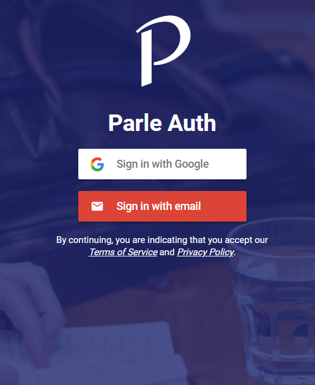
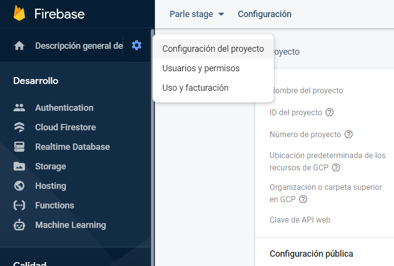

# Parle Auth

<p align="center">
  
</p>

## Prerequisite

Open this link to know the project configuration (Firebase Console):
Example: [Firebase Console - Configuration](https://console.firebase.google.com/u/0/project/parle-stage/settings/general)
<p align="center">
  
</p>

## Installation

Install the Firebase command line tool with `npm install -g firebase-tools` (See
[docs](https://firebase.google.com/docs/cli/#setup)).

Enable the Auth providers you would like to offer your users in the console, under
Auth > Sign-in methods.

Run:

```bash
git clone https://github.com/parle-cl/parle-auth.git
cd parle-auth
```

This will clone the repository in the current directory.

Copy `public/sample-config.js` to `public/config.js`:

```bash
cp public/sample-config.js public/config.js
```

For `public/config.js` data, you need check Prerequisite comment.

Then copy and paste the Web snippet code found in the console in the `config.js` file.

Finally, ensure you are in the `parle-auth/` folder, and run:
```bash
firebase serve
```

This will start a Firebase server locally at [http://localhost:5000](http://localhost:5000)

## Note

When you log in, Parle Auth will redirect to Parle App (Angular App), so, if you want log out, for now, you can use this url:
[http://localhost:5000/#logout=logout](http://localhost:5000/#logout=logout)
